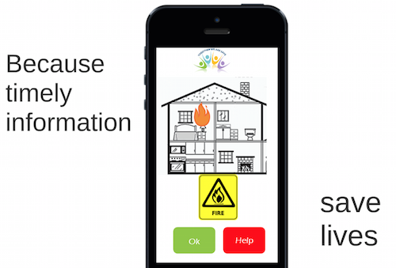
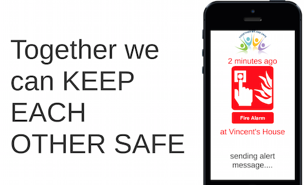

Ihackathon 25 to 27 sept 2015 / London by [@sbcInsurance](https://twitter.com/sbcInsurance)
https://www.eventbrite.co.uk/e/startupbootcamps-hack-insurance-hackathon-tickets-18457867980

read [Hackathon presentation](docs/Hackathon Insurance London - Startupbootcamp (25-27-sept 2015).pdf)
read [Intel IoT presentation](docs/Hackathon Insurance London - Intel IoT (25-27-sept 2015).pdf)


# Project "commUnity": service for house protection #

read [commUnity presentation pdf version)](docs/commUnity presentation.pdf)
read [online prezi](https://prezi.com/vwizq4hjmw6z/community/)

This project responds to challenge proposed by MMI Holdings
> Provide consumers with a technology-driven solution to help them make and keep themselves, their families and their communities safe in a simple, practical, tangible and mobile-first way.

##Safer together: mutualize protection of your house and your trusted neighbors##

* whenever a home alert is raised (from one of it sensors), analyze severity 
  * alert only house owner if low level (to cancel, confirm or ask help)
  * alert neighbors if owner does not respond or owner asks help  
* geolocation helps alerting correct persons (only neighbor that is at home)
* alerting communication done by SMS (app help tracking all home defects - see screenshots below) 


alert home owner | alert neighbors
 |   


##ideas (not developed)##

* connect home board (controlling sensors) of different houses together, in order to correlated alerts and ensure better communication between neighbors for alerting
* direct communication between home board and user smartphones (user can pair its smartphone with house board to accept being locally alerted) => easy way to know if people are at home, so it improves alerting
* in order to improve alert quality (avoid false alarms, etc)
  * keep track of data (ex: noise at night with NO light and in a time frame where house inhabitants are usually not here => high-level alert)
  * correlate sensor alert between houses (ex: if all houses have a sound alert, this may be due to an external noise) 


## System overview ##

1. Intel edison board with sensors (temperature, sound, light, buzzer) - in each house (owner and neighbors)
2. owner and neighbors phone numbers
3. saas platform 
  * receiving sensor events
  * correlating and analysing severity of events
  * then alerting (by SMS and push notification) owner, and / or neighbor, then police.
4. sms provider - we use twilio.com


## board (community-board) ##
nodeJS code

* more details in [readme](community-board/README.md)
* see file [temperature.js](community-board/temperature.js)

reads temperature every second. If too high, sends an alert on saas platform (see "sensor API" below)

## saas platform ##
server in java & spring-boot - see folder [community-platform](community-platform)

provides several APIs

### sensor API ###
allows sensors to push events
```
POST <server>/1/sensor/alert/<userId>
{
    location: "10 rainmaking loft, london",
    sensor: "fire",
    value: 45
}
```

### SMS API ###
when a user (owner or neighbor) receives SMS ans

### user API ###
it provides a view on user data: 
* sensors events (raw alerts)
* sms exchanged
* alerts : active and past (with severity level : owner, all, police)
```
GET <server>/1/user/<userId>
...
{
  "uid": "12345",
  "phoneNumber": "447793486734",
  "neighborPhoneNumbers": [
    "447472647105"
  ],
  "events": [
    {
      "location": "10 rainmaking loft, london",
      "sensor": "fire",
      "value": 10,
      "date": "2015-09-28T10:30:27.186"
    }
  ],
  "smsMessages": [
    {
      "type": "send",
      "body": "alert at 10 rainmaking loft, london : fire ? please reply OK or HELP",
      "uuid": "SM55390dcc717c40d594abcb32ac7e8a99",
      "fromPhone": "441274451669",
      "toPhone": "447793486734",
      "date": "2015-09-28T10:30:27.187"
    },
    {
      "type": "send",
      "body": "alert at Mr Smith 10 rainmaking loft, london: fire? please reply OK or HELP",
      "uuid": "SMe52d08d047504604b04334682c34c158",
      "fromPhone": "441274451669",
      "toPhone": "447472647105",
      "date": "2015-09-28T10:30:28.778"
    }
  ],
  "activeAlerts": [
    {
      "sensor": "fire",
      "location": "10 rainmaking loft, london",
      "currentLevel": "all",
      "startDate": "2015-09-28T10:30:27.186"
    }
  ]
}

```
